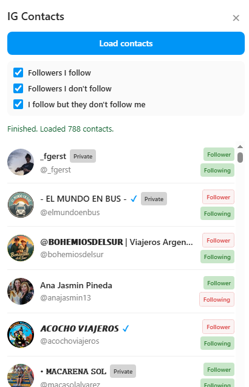

# IG Contacts Browser Extension

IG Contacts is a Chrome Manifest V3 extension that loads your Instagram followers and following lists, merges them into a single contact view, and shows relationship filters in a right-side panel.

## Features

- Loads followers and following from Instagram private endpoints
- Merges users by account id and marks relationship status:
  - Follower
  - Following
- In-page right panel with filters:
  - Followers I follow
  - Followers I do not follow
  - I follow but they do not follow me
- Caches loaded contacts in local storage for faster reopening
- Shows loading, success, and error status across popup/panel

## Requirements

- A browser with Developer mode enabled
- Active Instagram session in the browser (must be logged in)

## Install (Load Unpacked)

#### Google Chrome

1. Open chrome://extensions/
2. Enable Developer mode
3. Click Load unpacked
4. Select this folder

## How To Use

1. Open an Instagram page in a tab
2. Click the extension icon
3. Click Open side panel on Instagram
4. In the panel, click Load contacts
5. Use the filter checkboxes to segment contacts

## Data Flow

- popup.js -> content.js
  - action: toggleInPagePanel
- content.js -> background.js
  - action: loadContacts
  - action: getLoaderStatus
- background.js -> chrome.storage.local
  - key: igLoaderStatus
- content.js -> chrome.storage.local
  - key: igFollowersContactsCache

## Notes And Limitations

- This extension depends on Instagram private API behavior, which may change without notice.
- Requests use throttling delays to reduce rate-limit risk.
- If cookies `csrftoken` or `ds_user_id` are missing, loading contacts will fail.
- Large accounts can take time due to paginated loading.

## Development Notes

- No root package.json is currently used.
- Validation is manual by loading the extension in browser and testing:
  - popup open
  - panel toggle
  - contact loading
  - filter behavior

## Credits
- [Contacts](https://icons8.com/icon/T5URFachnKRD/contacts) icon by [Icons8](https://icons8.com)
- [Browser Extension Builder](https://skills.sh/sickn33/antigravity-awesome-skills/browser-extension-builder) skill
- Vibecoded using GitHub Copilot
- Inspired by [RemoveInstagramUnfollowers](https://github.com/ann0nip/RemoveInstagramUnfollowers) and [InstagramUnfollowers](https://github.com/davidarroyo1234/InstagramUnfollowers) and [this tutorial](https://www.youtube.com/watch?v=sjIBN05k7Ew)

## License

See LICENSE.
